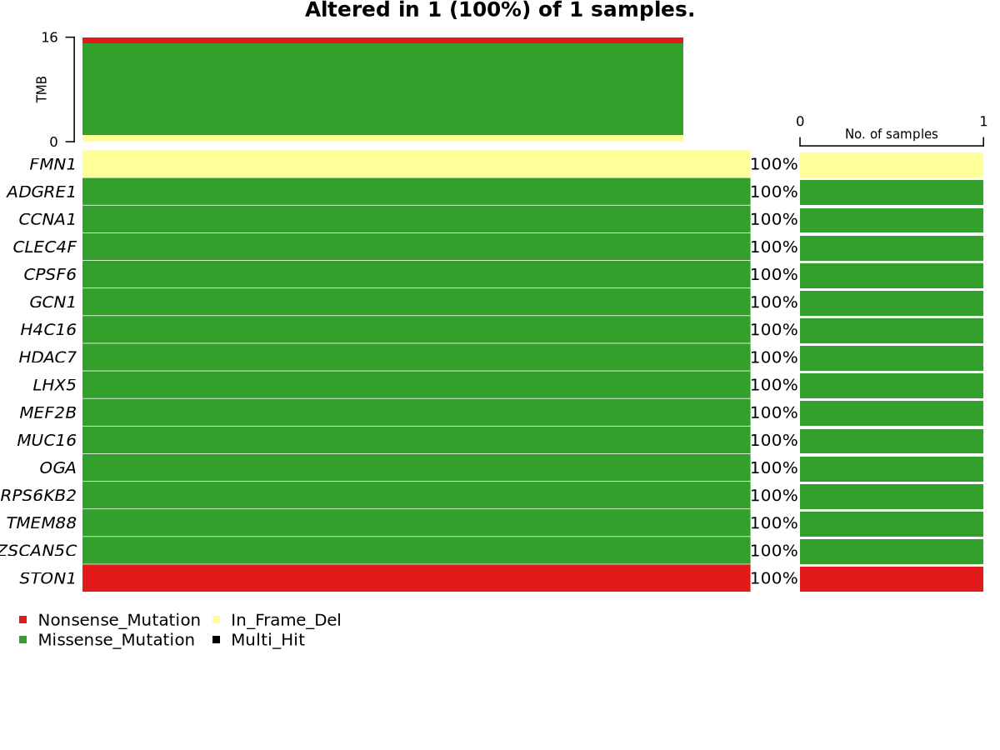
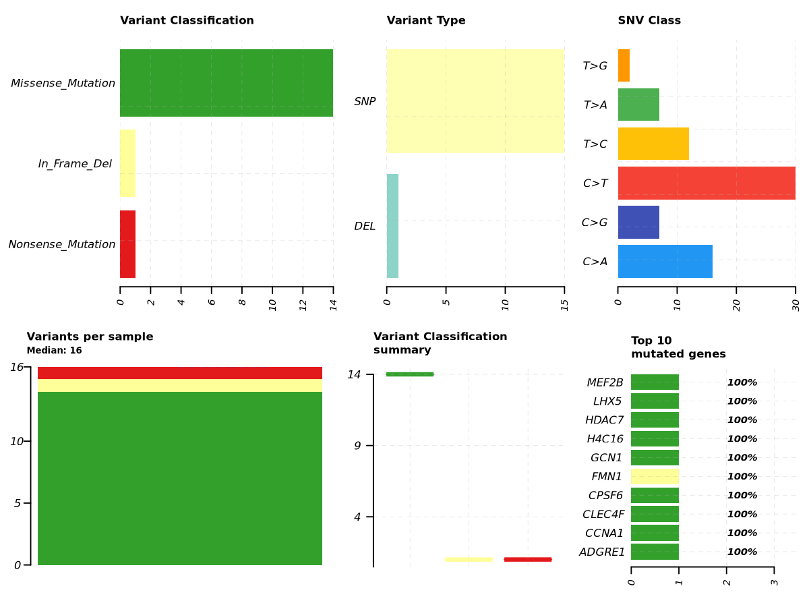

# GATK Somatic & Germline Variant Calling Pipeline

**Tumor–normal whole-exome variant calling on real patient cancer data, following the GATK4 Best Practices workflow (hg38).**

This project takes matched tumor and normal whole-exome sequencing (WES) reads from a real cancer patient and identifies both the **germline** variants the patient inherited and the **somatic** mutations the tumor acquired. It implements the full GATK4 Best Practices pipeline from raw reads through alignment, pre-processing, variant calling, filtering, functional annotation, and visualization.



*Oncoplot summarizing the coding somatic mutations identified in the tumor. Each row is a gene, colored by mutation type. Tumor Mutational Burden (TMB) is shown at top.*

---

## Table of Contents

1. [Background](#background)
2. [Dataset & Rationale](#dataset--rationale)
3. [Methodology](#methodology)
4. [Results](#results)
5. [Discussion](#discussion)
6. [Limitations & Future Work](#limitations--future-work)
7. [Reproducibility](#reproducibility)
8. [Repository Structure](#repository-structure)
9. [References](#references)

---

## Background

Cancer is fundamentally a disease of the genome. Distinguishing which DNA changes *cause or accompany* a cancer requires separating two very different classes of variant:

| | Germline | Somatic |
|---|---|---|
| **Origin** | Inherited from parents | Acquired during life |
| **Where** | In *every* cell of the body | Only in tumor cells |
| **Blood vs tumor** | Present in both (identical) | Present in tumor only |
| **Typical allele frequency** | ~50% (heterozygous) or ~100% (homozygous) | Often 5–40% (subclonal / mosaic) |
| **Caller used** | HaplotypeCaller | Mutect2 |
| **Question answered** | "What was this person born with?" | "What did the tumor acquire?" |

The key insight that drives the whole design is the **matched tumor–normal pair**. The patient's normal (blood) sample acts as a personalized "before" picture. By comparing the tumor against its matched normal, we can subtract everything the patient inherited and isolate the mutations that are unique to the cancer. This single design lets us demonstrate **both** arms of variant calling in one coherent project:

- **HaplotypeCaller** on the normal sample alone → germline variants.
- **Mutect2** on tumor-vs-normal → somatic variants (using the normal, plus population and artifact resources, to remove germline and technical noise).

---

## Dataset & Rationale

**Source:** Texas Cancer Research Biobank (TCRB) Open Access pilot — accessed via the NCBI Sequence Read Archive (BioProject **PRJNA285925**).

**Case:** TCR000484, a matched tumor–normal whole-exome pair.

| Sample | SRA Run | Role |
|---|---|---|
| Normal | SRR2089359 | Matched normal (germline reference) |
| Tumor | SRR2089355 | Tumor |

**Why this dataset?** Most patient-level cancer sequencing data (e.g. TCGA raw BAMs) sits behind controlled-access gatekeeping (dbGaP), which is not readily available to independent researchers. The TCRB Open Access pilot is a rare exception: it freely shares genomic data from **7 real cancer patients with matched normals**, with only a click-through acknowledgment and no data-use-agreement barrier. This makes it uniquely suited to a reproducible, publicly shareable portfolio project built on *genuine patient tumor–normal data* rather than simulated or cell-line reads.

**Reference genome:** GRCh38 / hg38 (Broad Institute GATK resource bundle).

> **Honest caveat:** TCRB variant calls were originally generated against hg19. This project re-aligns the raw reads to hg38 from scratch, so the pipeline and its calls are independent of the original TCRB analysis (and use the current reference build).

**Known-sites & somatic resources** (all hg38, from the Broad / GATK best-practices bundles):
- dbSNP138 and Mills & 1000G gold-standard indels — used as known sites for base quality score recalibration.
- gnomAD (allele-frequency-only) — germline resource for Mutect2.
- 1000G Panel of Normals — recurrent technical artifacts for Mutect2.

---

## Methodology

The pipeline follows the GATK4 Best Practices workflow. All heavy steps were run on AWS EC2 (r5-family instances), scaling instance size to the memory demands of each step.

```
FASTQ (tumor + normal)
   │  bwa-mem2 mem  (+ read groups)   → align to hg38
   ▼
Coordinate-sorted BAM  (samtools sort)
   │  GATK MarkDuplicates             → flag PCR duplicates
   ▼
Deduplicated BAM
   │  GATK BaseRecalibrator + ApplyBQSR (dbSNP + Mills)
   ▼                                  → recalibrate base quality scores
Analysis-ready BAM ───────────────┬───────────────────────────┐
                                   ▼                           ▼
                     HaplotypeCaller (normal)      Mutect2 (tumor vs normal)
                                   │               (+ gnomAD germline resource,
                                   │                  Panel of Normals)
                                   ▼                           ▼
                     Germline VCF                  Raw somatic VCF
                                                   │  FilterMutectCalls
                                                   ▼
                                                   Filtered somatic VCF → PASS only
                                                   │  Funcotator (hg38 data sources)
                                                   ▼
                                                   Annotated MAF
                                                   │  maftools (R)
                                                   ▼
                                                   Oncoplot + MAF summary
```

### Step-by-step

1. **Data retrieval.** SRA runs downloaded with `prefetch` and converted to FASTQ with `fasterq-dump` (single-threaded, one sample at a time, for stability).

2. **Alignment** (`bwa-mem2 mem`). Reads aligned to hg38 with explicit **read groups** (`@RG` with `SM:normal` / `SM:tumor`), which GATK requires to distinguish samples. Output piped directly into `samtools sort` to produce coordinate-sorted BAMs. The reference was indexed with `bwa-mem2 index` (a memory-intensive one-time step requiring a large-memory instance).

3. **Mark duplicates** (`gatk MarkDuplicates`). Flags reads arising from PCR amplification of the same original fragment, so the caller does not mistake amplified copies of a single error for independent supporting evidence.

4. **Base Quality Score Recalibration** (`gatk BaseRecalibrator` → `ApplyBQSR`). Sequencer-reported base qualities are *systematically* biased. Using dbSNP and Mills known sites as a truth reference (mismatches at known sites are treated as real variants; mismatches elsewhere as errors), BQSR measures the true error rate and rewrites the quality scores so the caller weighs evidence with honest confidence values.

5. **Germline calling** (`gatk HaplotypeCaller`). Run on the analysis-ready **normal** BAM to call inherited variants via local de-novo assembly of candidate haplotypes.

6. **Somatic calling** (`gatk Mutect2`). Run on tumor + normal together, with the matched normal, the gnomAD germline resource, and the Panel of Normals used to subtract germline variants and recurrent artifacts. Restricted to the main chromosomes (chr1–22, X, Y). Mutect2 retains low-allele-frequency (subclonal) mutations that a germline caller would dismiss as noise.

7. **Filtering** (`gatk FilterMutectCalls`). Applies statistical filters and labels each call `PASS` or with a failure reason (weak evidence, germline risk, strand bias, normal artifact, etc.). Only `PASS` calls are carried forward.

8. **Annotation** (`gatk Funcotator`, hg38 somatic data sources → MAF). Adds gene symbols, variant classification (missense/nonsense/etc.), and protein change to each variant.

9. **Visualization** (`maftools` in R). Reads the MAF and produces the oncoplot and MAF summary figures.

**Tools:** `bwa-mem2`, `samtools`, `GATK 4.6`, `bcftools`, `Funcotator`, `R` + `maftools`, orchestrated in a `conda`/`mamba` environment.

---

## Results

### Alignment & pre-processing QC

| Metric | Normal (SRR2089359) | Tumor (SRR2089355) |
|---|---|---|
| Total reads | ~81.9 M | ~93.4 M |
| Mapped | **99.51%** | **99.76%** |
| Paired in sequencing | 100% | 100% |
| Duplication rate | **6.9%** | **6.6%** |

Both samples aligned with >99% mapping and low, consistent duplication rates (well under the ~20% threshold that would indicate an over-amplified, low-input library) — indicating high-quality input data and correct alignment against a clean reference.

### Variant calling

| Output | Count |
|---|---|
| Germline variants (HaplotypeCaller, normal) | **303,842** |
| Raw somatic candidates (Mutect2) | 5,398 |
| **High-confidence somatic (PASS)** | **81** |

The germline count (~300K) is typical for a human exome — the vast majority is common inherited variation. On the somatic side, the drop from 5,398 raw candidates to 81 PASS variants (~98.5% filtered) is expected and desirable: genuine somatic mutations are rare, and most raw calls are germline leakage or technical artifacts. The dominant filter reasons — `weak_evidence`, `germline`, `normal_artifact`, `panel_of_normals`, `slippage` — are exactly the categories the matched normal, gnomAD, and Panel of Normals are designed to catch, confirming the filtering machinery worked as intended.

### Somatic mutation landscape

Of the 81 PASS somatic variants, ~16 fall in coding regions and are summarized in the oncoplot above and the MAF summary below.



*Distribution of variant classifications and per-sample mutation load.*

The coding mutations are predominantly missense, with a nonsense mutation (STON1) and an in-frame deletion (FMN1) among them.

---

## Discussion

The pipeline successfully produces the complete GATK Best Practices output for a real patient tumor–normal pair: analysis-ready BAMs, a germline callset, a filtered somatic callset, and an annotated, visualized somatic mutation landscape.

A few honest interpretive points:

- **No canonical driver genes** (e.g. *TP53*, *BRCA1*, *PIK3CA*) appear among the top coding hits. This is expected for a single tumor–normal case. Robust cancer-driver identification is a **cohort-level** exercise — it relies on finding genes recurrently mutated across many patients, which cannot be done from one case. The genes seen here (e.g. *MUC16*, which is frequently mutated across cancers largely because of its very large size) are consistent with a single-sample passenger-dominated profile.

- **The value of this project is the working, reproducible pipeline**, not novel biology. It demonstrates end-to-end competence: read alignment, GATK pre-processing, both germline and somatic calling, resource-aware filtering, annotation, and visualization — the exact skill set required for a variant-analysis role.

- **The filtering behaved correctly.** The specific filter labels applied to the ~5,300 rejected calls show the matched normal, gnomAD, and Panel of Normals actively removing germline and artifact signal, which is the core logic of somatic calling made visible.

This project was also a substantial **applied-debugging** exercise. Several real infrastructure failures were diagnosed and resolved, including: a corrupted (duplicated) reference FASTA caught via contig-count verification; an ancient `samtools` build that silently broke sorting; a `bwa-mem2` index build that was OOM-killed until moved to a larger-memory instance; and a Mutect2 Java-heap crash on the alt/HLA contigs, resolved by restricting to the main chromosomes and raising the heap. Each was diagnosed by isolating the failing component, surfacing suppressed errors, and verifying claims against data rather than assumptions.

---

## Limitations & Future Work

- **Single case.** Only one tumor–normal pair (TCR000484) is analyzed. Scaling to the other TCRB Open Access cases would enable recurrence-based interpretation and a far more informative multi-sample oncoplot.
- **No orthogonal validation.** Calls are not cross-checked against the original TCRB (hg19) calls or an independent caller.
- **Contamination estimation not applied.** `GetPileupSummaries` / `CalculateContamination` (using the downloaded `small_exac_common` resource) could further refine filtering.
- **Manual orchestration.** The pipeline is currently a set of shell scripts run step by step. Wrapping it into a **Snakemake** workflow with per-sample wildcards would make it fully reproducible and trivially scalable to all TCRB cases — the natural next step and a key production-readiness signal.

---

## Reproducibility

**Environment** (conda/mamba, `conda-forge` prioritized, Python 3.10):

```bash
mamba create -n gatk-var python=3.10 -y
mamba activate gatk-var
mamba install -c conda-forge -c bioconda \
    bwa-mem2 samtools bcftools gatk4 \
    fastqc multiqc trim-galore snakemake sra-tools \
    bioconductor-maftools r-base -y
```

**Pipeline scripts** live in `workflow/scripts/` and are run in order:

```
align_normal.sh / align_tumor.sh          # bwa-mem2 + sort (+ read groups)
markdup_normal.sh / markdup_tumor.sh      # MarkDuplicates
bqsr_normal.sh / bqsr_tumor.sh            # BaseRecalibrator + ApplyBQSR
haplotypecaller_normal.sh                 # germline (HaplotypeCaller)
mutect2.sh                                # somatic (Mutect2, chr1-22,X,Y)
filter_mutect.sh                          # FilterMutectCalls
funcotator.sh                             # annotate -> MAF
oncoplot.R                                # maftools figures
```

> **Note on data files.** Large intermediates (FASTQ, BAM, VCF, reference genome, and annotation data sources) are intentionally **not** committed — they are gigabytes in size and are regenerable from the scripts plus the public source data. Only scripts, small result files (annotated MAF, QC stats), and figures are tracked. See `.gitignore`.

---

## Repository Structure

```
gatk-somatic-variant-calling/
├── README.md
├── .gitignore
├── data/
│   └── tcrb_runinfo.csv                  # SRA run metadata (provenance)
├── workflow/
│   └── scripts/                          # all pipeline steps (bash + R)
└── results/
    ├── variants/
    │   ├── somatic.funcotated.maf        # annotated somatic calls
    │   ├── somatic.vcf.gz.stats
    │   └── somatic.filtered.vcf.gz.filteringStats.tsv
    └── figures/
        ├── oncoplot.png
        └── maf_summary.png
```

---

## References

1. **TCRB Open Access:** Becnel LB, et al. *An open access pilot freely sharing cancer genomic data from participants in Texas.* Scientific Data (2016). BioProject PRJNA285925.
2. **GATK Best Practices:** Van der Auwera GA, O'Connor BD. *Genomics in the Cloud* (O'Reilly, 2020); Broad Institute GATK Best Practices workflows.
3. **bwa-mem2:** Vasimuddin M, et al. *Efficient architecture-aware acceleration of BWA-MEM* (IPDPS 2019).
4. **Mutect2:** Benjamin D, et al. *Calling Somatic SNVs and Indels with Mutect2.* bioRxiv (2019).
5. **maftools:** Mayakonda A, et al. *Maftools: efficient and comprehensive analysis of somatic variants in cancer.* Genome Research (2018).
6. **gnomAD:** Karczewski KJ, et al. *The mutational constraint spectrum quantified from variation in 141,456 humans.* Nature (2020).

---

*Pipeline built and debugged end-to-end on AWS EC2. Germline + somatic arms, GATK4 Best Practices, hg38.*
